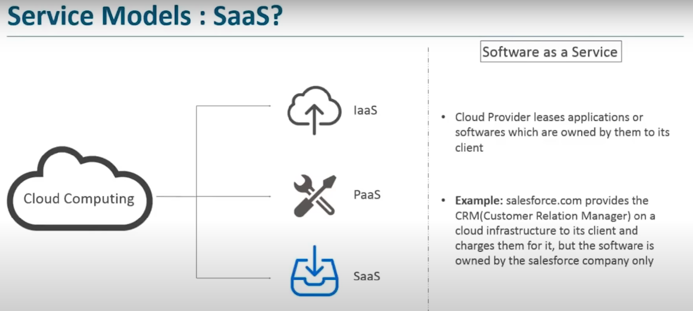
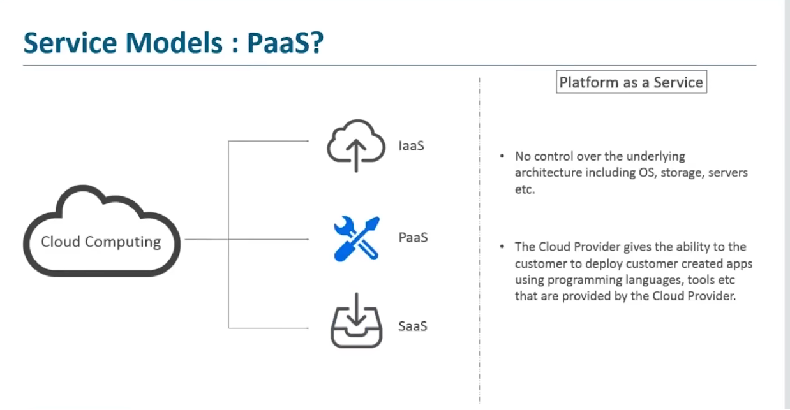
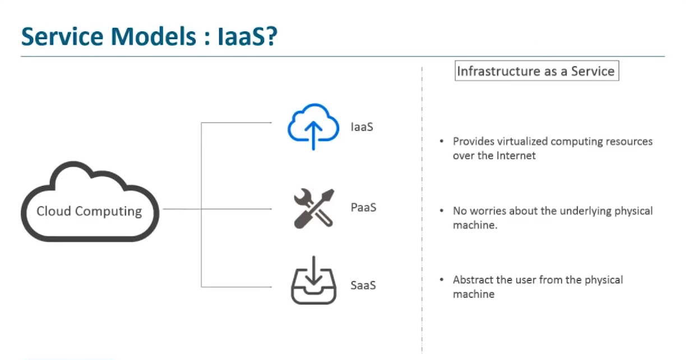

## Saas {Software as a service }

### Example
- Gmail

## Paas {Platform as a service}

### Example
- Heroku
- Microsoft Azure
- Google App Engine

## Iaas {Infrastructure as a service}

### Example
- Amazon Web Services (AWS)
- Elastic Compute Cloud (EC2)
- Joyent

## Service Model
